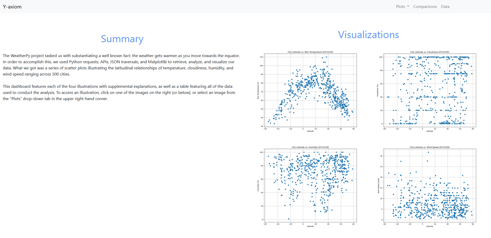

# Y-axiom

Y-axiom is a simple data dashboard built atop of the analytics gathered from the WeatherPy project (https://github.com/theodoremoreland/WeatherPy). WeatherPy used Python requests, APIs, JSON traversals,
and Matplotlib to retrieve, analyze, and visualize data across various dimensions of weather as it relates to latitudinal position. The results were a series of scatter plots illustrating
the latitudinal relationships of temperature, cloudiness, humidity, and wind speed ranging across 500 cities. Y-axiom uses HTML/CSS and Bootstrap to build a static website featuring said visualizations, which is currently being host on AWS S3.

This dashboard features each of the four illustrations with supplemental explanations, as well as a table featuring
all of the data used to conduct the analysis (note: the data table has not been kept up-to-date). Below is a preview of the dashboard.

# Home Screen

# Max Temperature Page

# Humidity Page

# Cloudiness Page

# Wind Speed Page

# Comparisons Page

# Data Table
